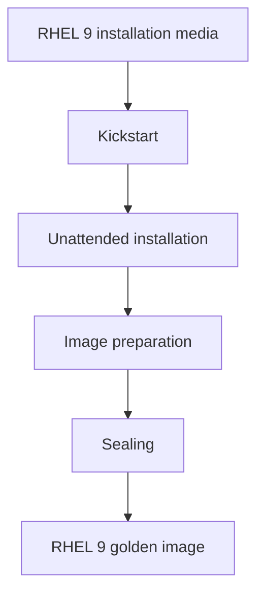

# RHEL Golden Image

A reproducible **RHEL 9 golden image** built with Kickstart for my
[Linux Platform Engineering](https://github.com/lxrider/linux-platform-engineering) lab.

The goal is simple: build a clean reference image that can be rebuilt,
validated and reused as the backing image for disposable QCOW2 clones.

## What this repository does



This repository is responsible for the **image lifecycle**.

The topology, VM roles and lab configuration live in
[linux-platform-engineering](https://github.com/lxrider/linux-platform-engineering).

I prefer keeping those responsibilities separate:

- this repository builds the reference image
- the platform repository uses it
- configuration and experiments happen on disposable clones

## Why a golden image?

Mostly because rebuilding is more interesting than repairing configuration drift :)

If the reference image can be created again from documented and version-controlled
configuration, I know exactly where my lab started from.

The image intentionally stays close to a clean RHEL installation.

Hardening and role-specific configuration come later in the lifecycle, where
their purpose and impact remain visible.

## Requirements

KVM host running Ubuntu Server 24.04:

```bash
sudo apt install -y virtinst libvirt-daemon-system ovmf libguestfs-tools qemu-utils
```

## Usage

### 1. Check the ISO

A RHEL 9 **Binary DVD** is expected at:

```text
/var/lib/libvirt/boot/rhel9.iso
```

You can override it with:

```bash
ISO=/path/to/rhel9.iso
```

The image must contain the package trees. A Boot ISO is not enough.

```bash
sudo mkdir -p /mnt/iso
sudo mount -o loop,ro /var/lib/libvirt/boot/rhel9.iso /mnt/iso

ls /mnt/iso
# expected: BaseOS/  AppStream/

sudo umount /mnt/iso
```

### 2. Build

The build script asks once for a password, then runs the installation unattended.

```bash
chmod +x scripts/*.sh
./scripts/build.sh
```

The installation usually takes around 10 to 20 minutes.

The VM powers off automatically when the build is complete.

You can follow the installation from another shell:

```bash
sudo virsh console rhel9-golden
```

Exit the console with:

```text
Ctrl+]
```

### 3. Seal

Once the installation is validated:

```bash
./scripts/seal.sh
```

The sealing step prepares the VM to become a reusable reference image,
cleans machine-specific state and compacts the disk.

> Once sealed, the image is **never booted directly again**.
> Linked clones depend on it as a read-only backing file.

## What you get

The image contains an administrative account:

```text
labadmin
```

It belongs to the `wheel` group.

The root account and `labadmin` use the password provided at build time.

The SSH public key of the user running the build is installed for `labadmin`.

Disk layout:

```text
/boot/efi    600M   vfat
/boot       1024M   xfs

vg_system
    |
    +-- lv_root   10G   xfs
    |
    +-- lv_swap    2G   swap
    |
    +-- ~8G left unallocated intentionally
```

## Design notes

### DVD-only build

The installation uses the RHEL Binary DVD and does not require registration.

This keeps the build reproducible and avoids storing Red Hat credentials in
the repository.

### UEFI / GPT

The image uses UEFI and GPT.

Boot-related exercises such as `grubby` and `rd.break` remain available for
practice.

### Stock security posture

The image stays close to a default RHEL installation:

- SELinux enforcing
- firewalld enabled
- no GRUB password

The last point is intentional because root password recovery is part of the
RHCSA practice environment.

### Free space in the volume group

Some space is intentionally left unused in `vg_system`.

This gives me room to practise:

```text
lvextend
lvcreate
filesystem growth
```

without having to modify the virtual disk first.

### Keep the image simple

Nothing is pre-configured that I am supposed to learn or configure myself.

The golden image gives me a clean starting point.

The clones are where the work happens.

## Secrets

No passwords or rendered Kickstart files are stored in the repository.

The repository contains the **Kickstart template only**.

During the build:

1. the password hash is generated into a temporary file
2. the temporary file is created with mode `0600`
3. the generated file is deleted automatically when the script exits
4. Anaconda's `/root/anaconda-ks.cfg` is shredded during `%post`

Never commit a rendered `.ks` file containing credentials.

## Related project

This image is used by:

[linux-platform-engineering](https://github.com/lxrider/linux-platform-engineering)

## Build it once. Understand it. Rebuild it whenever you need.
